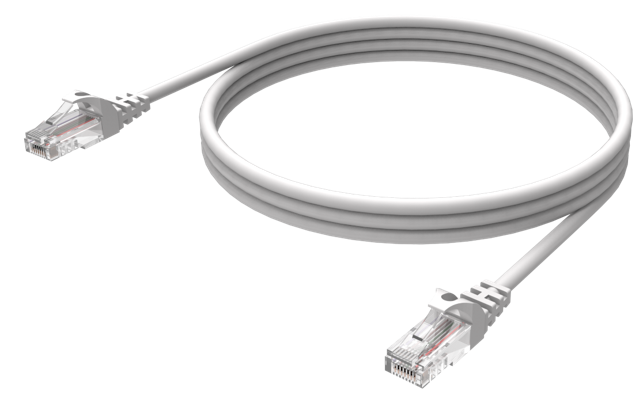
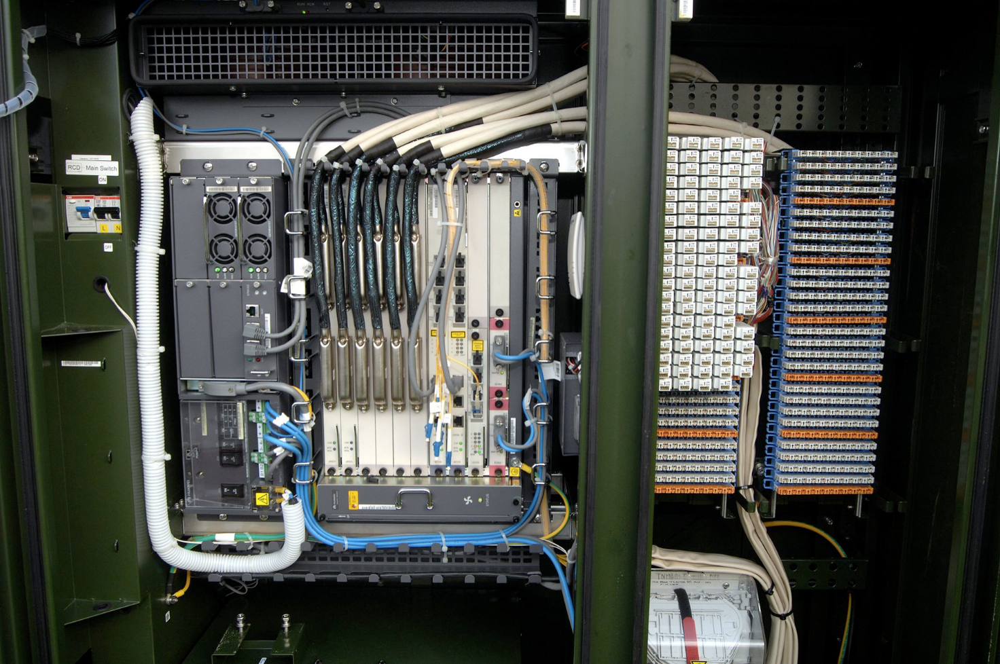

# Broadband vs Ethernet: How They Differ and Work Together

**By Constantin Kioulafas**  
*Originally written: February 2022 · Revised: August 2026*

Broadband has come to mean always on, high-speed, high-capacity / wide-bandwidth access to the Internet. Broadband access can be achieved over a number of connection media, such as coaxial cable, satellite, wireless, copper wire, and fiber-optic cable.

Almost all Internet subscriber connections today are implemented over a broadband connection.

Ethernet, on the other hand, refers to a family of wired networking technologies that define the physical connection and the low-level rules used to transmit data between network devices.

Almost anyone who has used a wired connection on a network will know of Ethernet cables that connect personal computers (and other devices) to a Local Area Network (LAN), usually via a network switch of some type.

## Broadband

Broadband generally refers to wide bandwidth data transmission. However, with almost all forms of communication and online services having taken the route of the Internet, it has become synonymous with high-bit-rate Internet access.

According to the FCC, broadband refers to high-speed Internet access that is always on and faster than traditional dial-up access. The types of broadband Internet connections available include Digital Subscriber Line (DSL), cable, fiber, wireless, and satellite.

DSL and cable are the most common forms of broadband connection in the U.S. for households, while fiber-optic connections are more common for large businesses. DSL uses the existing telephone copper cables already in place, while cable uses the coaxial cables used to deliver cable TV.

## Ethernet

While most of us tend to think of Ethernet as only referring to the physical medium used in network connections, it also defines how data is transmitted over that medium, including error detection (but not error correction).

We’ll be taking a look at Ethernet cabling media and the protocol before discussing what role it plays in broadband, and specifically, broadband Internet access.

Twisted-pair copper Ethernet cables are classified according to their category, which is based on the bandwidth frequency the cable can handle, the maximum data rate supported, and whether the cable is shielded or unshielded.

Typical Ethernet LAN connection speeds of 10 Mbps, 100 Mbps, and 1 Gbps use Category 5 and Category 5e (more commonly referred to as Cat5 and Cat5e respectively) and unshielded twisted pair (UTP) cables.

While Cat5 and Cat5e Ethernet cables are the most common, Cat6 and Cat6a are now coming into more use as data transmission speeds begin to go well into the gigabit range.

An Ethernet UTP cable has four unshielded twisted pairs of copper conductors, terminated with RJ-45 connectors.

Ordinarily, with other types of telecommunications and network cables, shielding is used in order to cut down on noise and crosstalk from neighboring cables. With unshielded Cat5 and Cat6 cables for speeds up to 1 Gbps, this is achieved by sufficient twisting of each pair of wires.

Not having to shield the cables also helps keep the cost down, which is why this type of cable is so popular.

One limitation of twisted-pair Ethernet cables is that they cannot be used over long runs. The specifications for Cat5 and Cat5e cables stipulate a maximum channel length of 328 ft (100 meters) at data rates up to 1 Gbps.

Cat6a also has a maximum range of 328 ft, but can handle data rates up to 10 Gbps.

Going over the 328 ft maximum range does not mean that the connection will no longer work, but depending on the quality of the cable, the signal will start to degrade as the run gets further away from the source.

Two measurements used to gauge the quality of a connection are signal-to-noise ratio (SNR) and attenuation. Attenuation is a weakening of the signal as it travels further away from its source, while SNR indicates how strong the signal is compared to any noise on the line.

While we’ve dealt with the physical aspect of Ethernet, we also need to take a quick look at how data is transmitted over the medium, so as to understand how it fits in with broadband Internet.

At the data-link layer, data sent over Ethernet is organized into units called frames. Each frame contains the source and destination MAC addresses and includes a frame check sequence (FCS) used for error detection.

While any frames with errors are discarded, it is up to higher-level protocols (typically at the Transport Layer in the Open Systems Interconnection model or OSI model) to request the retransmission of lost data.

## Rounding Up

While many ISPs are slowly converting their subscriber connections to fiber-optic cable, which will give subscribers gigabit Internet access, fiber is still an expensive medium and it will take time to replace the copper cabling already in place.

Recent developments in Very-high-bit-rate Digital Subscriber Line (VDSL) technology have allowed providers to offer 100 Mbps and higher over the existing copper wire infrastructure.

VDSL2 can support data rates above 100 Mbps, while Super VDSL (also referred to as VDSL2-Vplus) can offer around 300 Mbps downstream on short copper loops.

Providers will usually install a Fiber to the Curb (FTTC) cabinet in neighborhoods, with a fiber-optic cable connection from the data center and then use the existing copper lines to provide a VDSL connection between the cabinet and the subscriber’s premises.

Ethernet in the First Mile (EFM), defined by the IEEE 802.3ah standard, also includes technologies designed to provide Ethernet access over the first-mile connection between a provider and subscriber. As long as the distance from the subscriber to the cabinet is inside the 1000 ft range, very high-speed broadband connections can be offered.

So, what does all this have to do with Ethernet? Well, remember we mentioned earlier that Ethernet is not just a cable specification; it also includes rules for transmitting data in frames.

The Ethernet low-level protocol is not only used over a LAN, such as the connection between a PC and a router or modem. Ethernet is also used over fiber-optic networks and in some first-mile access networks, some of which use VDSL connections to customer premises.
