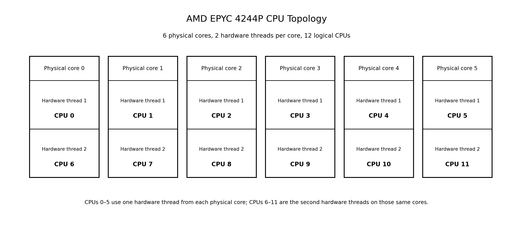
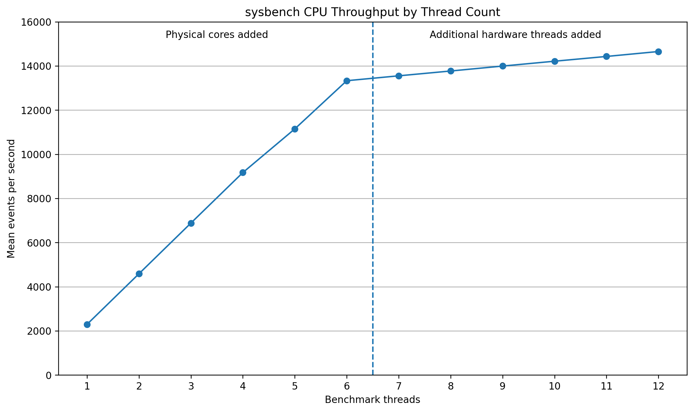
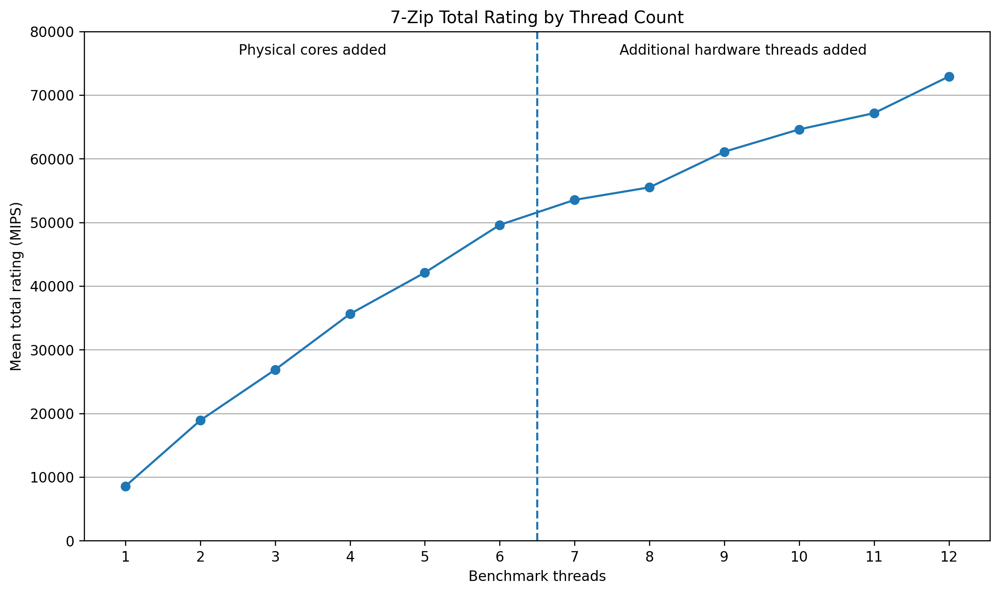

# CPU Cores vs Threads: Theory, SMT, and Benchmark Performance

**Constantin Kioulafas**  
*Published August 2026*

[PDF version](cpu-cores-vs-threads-theory-smt-and-benchmark-performance.pdf)

In the late 1970s and early 1980s, desktop computer operating systems had very basic requirements by today’s standards. Operating systems like CP/M and MS DOS were limited to one user at a time who could only execute one program at a time.

Only when the currently running program finished executing or was terminated by the user, could another program be run.

Typical microprocessors of that time, such as the Intel 8080, Zilog Z80, Motorola 6800, MOS Technology 6502 had a single 8-bit core, could address 64 kB of 8-bit memory over a 16-bit address bus, and ran at clock frequencies of 1 to 4 MHz.

They operated by fetching an instruction from memory, executing it, then fetching the next instruction, executing it, and so on. For CP/M and MS DOS, this was perfectly adequate.

Another, contemporary operating system was UNIX. Unlike CP/M or MS DOS, this was a multi-user, multi-tasking operating system, meaning that several users could be using the system at the same time, and each user could be running one or more programs at the same time.[^1]

So how did UNIX execute several programs from several users simultaneously, with a single core microprocessor? The operating system’s kernel ran a piece of code called a process scheduler to very rapidly switch between users and their processes, allocating each a slice of microprocessor time.

In other words, the microprocessor and computer resources were time shared or time multiplexed between processes. This task or context switch happened thousands of times per second and gave the illusion that each user had exclusive use of the system.

Today’s microprocessors, more commonly called CPUs (Central Processing Units), have multiple 64-bit cores. A 64-bit address space can theoretically address up to 16 exabytes of memory, although practical capacity is limited by current processor architectures utilizing fewer address bits, as well as by operating system restrictions.[^2] A typical desktop or laptop system may have 16 GB to 64 GB of RAM, while server systems commonly use hundreds of gigabytes and can extend into several terabytes.

Furthermore, modern desktop and laptop CPUs typically operate at frequencies in the 3 GHz to 5 GHz range, with high-end desktop processors reaching 6 GHz or more using manufacturer boost technologies.[^3]

In order to fit increasing numbers of cores and other circuitry into a single package, semiconductor manufacturers have continued to move to more advanced process nodes. Over the last five years, leading-edge production has progressed well beyond the 7 nm generation, with 3 nm processes now well established and 2 nm processes having entered high-volume production.[^4] At these scales, physical, thermal, and manufacturing constraints make further scaling progressively more difficult.

Chip designers, therefore, are always looking for methods to better or more efficiently utilize resources and offer greater processing power. Apart from multiple cores, many CPUs now also incorporate a feature called Simultaneous Multi-Threading.

The first part of this article looks at the theory behind CPU cores, threads, and SMT. We then put this to the test with two benchmarks - one synthetic and the other real-world - to see how closely practical performance reflects what the architecture and processor specifications lead us to expect.

## What is a Core

In simple terms, a core is a single processing unit (with its own control unit, arithmetic logic unit or ALU, registers, cache memory), capable of independently executing instructions in a computational task. Executing an instruction involves a three phased cycle of fetch, decode and execute, commonly known as the instruction cycle.

With older CPUs, the full cycle was completed before the next instruction was fetched and the cycle repeated. Modern CPUs, however, use instruction pipelining, which allows the processor to fetch the next instruction while the current instruction is still being processed.

Historically, one of the principal ways of increasing CPU performance was to raise the operating frequency, allowing more processing cycles to take place each second.

As frequencies increased however, power consumption and heat dissipation became increasingly difficult to manage, while shrinking transistor dimensions introduced additional physical constraints. Modern processor design therefore no longer relies primarily on ever-higher clock frequencies to increase performance.

In order to pack more processing power, chip designers have, for quite some time, been incorporating more than one processing unit or core in a single CPU package. Each core can execute instructions independently of and simultaneously with the other cores in the package.

The IBM POWER4 dual-core processor was released in 2001, becoming the first processor to place two high-performance CPU cores on a single chip.[^5] Since then, other manufacturers, including Intel and AMD, have released their own multi-core processors, and multi-core designs have become standard across desktop, laptop, mobile, and server CPUs.

## What is a Thread

In software, a thread is a single chain of instructions or code that can execute independently of, and concurrently with, other sections of code. A thread has its own program counter, stack, and set of registers.

When referring to threads in CPU specifications, the term usually refers to hardware thread contexts rather than the software threads themselves. Simultaneous Multi-Threading (SMT) allows a physical processor core to maintain and execute instructions from more than one hardware thread at the same time.

SMT support varies between processor architectures and generations. AMD, for example, widely uses two-way SMT across its Ryzen and EPYC processor families, while Intel refers to its implementation as Hyper-Threading Technology (HTT).

SMT implementations exist, supporting two, four, or eight hardware threads per core.[^6] With two-way SMT, a physical core exposes two hardware thread contexts, which the operating system sees as two logical CPUs. Neither hardware thread is itself a physical core; both operate on the same core and share many of its execution resources.

Performance gains from SMT vary considerably according to the workload. AMD states that workloads able to benefit from SMT can often see performance gains in the range of 30% to 50%, while Intel has previously quoted improvements of up to around 30% for Hyper-Threading in suitable multithreaded applications.[^7] These figures should not be considered a fixed performance increase however, since some workloads benefit much less, while others may see little or no improvement.

Applications do not normally control SMT directly. They create software threads, and the operating system scheduler assigns those threads to the logical CPUs made available by the processor. A single-threaded application has only one thread of execution, something that was much more common with older, traditional applications. If that thread is blocked waiting for an I/O operation to complete, the application cannot continue executing until the thread is able to proceed.

Modern applications are commonly multi-threaded, with multiple threads within a single process. If one thread is blocked waiting for an I/O operation, other threads may continue to execute.

A typical example is a word processor, which has to process keyboard input, perform spelling checks, and auto-save the document. In a single threaded application, each of these tasks would be performed in series, possibly resulting in momentary unresponsiveness from the keyboard while the auto-save function completes.

In a multi-threaded application, these tasks can execute concurrently and, where processor resources allow, in parallel, so that a delay in one task does not necessarily hinder or impact on the others.

## Putting Cores and Threads to the Test

The theory explains why physical CPU cores and additional hardware threads provided by SMT are not equivalent. A physical core has its own execution resources, while SMT allows two hardware threads to share many of those resources. What the theory cannot tell us however, is exactly how much additional performance SMT will provide. That depends heavily on the workload.

To examine the difference in practice, two benchmark workloads were run on a six-core, twelve-thread AMD EPYC processor. The first, sysbench CPU,[^8] provides a controlled synthetic CPU workload. The second uses 7-Zip's[^9] built-in compression and decompression benchmark, providing an application-based workload that exercises the processor differently.

### Test System

The benchmark tests were carried out on a bare-metal OVH server equipped with an AMD EPYC 4244P processor. The processor has six physical cores and supports Simultaneous Multi-Threading (SMT), with two hardware threads available per core, giving the operating system a total of 12 logical CPUs.[^10]

The relevant hardware, operating system, and benchmark software specifications are shown below.

| Component | Specification |
|---|---|
| Processor | AMD EPYC 4244P |
| Architecture | x86-64 |
| CPU sockets | 1 |
| Physical cores | 6 |
| Hardware threads | 12 |
| SMT | 2 hardware threads per physical core |
| NUMA nodes | 1 |
| L1 data cache | 192 KiB total |
| L1 instruction cache | 192 KiB total |
| L2 cache | 6 MiB total |
| L3 cache | 32 MiB |
| System memory | 64 GB |
| Environment | OVH bare-metal server |
| Operating system | AlmaLinux 9.8 (Olive Jaguar) |
| Kernel | 5.14.0-611.34.1.el9_7.x86_64 |
| CPU frequency driver | acpi-cpufreq |
| CPU governor | performance |
| **Benchmarking applications used** | |
| Synthetic CPU benchmark | sysbench 1.0.20 |
| Application-based benchmark | 7-Zip 26.02 (x64) |

#### CPU Topology

Although the operating system sees 12 logical CPUs, these are provided by six physical processor cores. Each physical core provides two hardware threads, with the logical CPU numbering arranged as follows:

| Physical core | Hardware thread 1 | Hardware thread 2 |
|---|---|---|
| Core 0 | CPU 0 | CPU 6 |
| Core 1 | CPU 1 | CPU 7 |
| Core 2 | CPU 2 | CPU 8 |
| Core 3 | CPU 3 | CPU 9 |
| Core 4 | CPU 4 | CPU 10 |
| Core 5 | CPU 5 | CPU 11 |



*Figure 1. AMD EPYC 4244P CPU Topology*

This distinction becomes important during testing. CPUs 0 through 5 provide one hardware thread from each of the six physical cores. CPUs 6 through 11 provide the second hardware thread from those same six cores. We can therefore test performance first by progressively adding physical cores, and then continue by adding the second hardware thread from each core.

### Benchmark Methodology

#### Thread Configuration and CPU Affinity

Under normal operation, an application does not usually decide which processor core will execute each of its threads. The operating system scheduler makes that decision, assigning threads to the logical CPUs that are available and moving them from one logical CPU to another as required.

For general computer use this is exactly what we want, since the operating system can balance the workload across the processor. For benchmarking physical cores and the effect of SMT however, it introduces a problem. If a six-thread benchmark is allowed to run freely, the operating system could distribute those threads across six physical cores, or it could place some of them on hardware threads belonging to the same physical core. We would then know how many threads were running, but not exactly which physical CPU resources were being used.

To avoid this, CPU affinity was used to restrict each benchmark to a known set of logical CPUs. Under Linux this was done with the `taskset` command, which sets the CPU affinity for the benchmark process.[^11] The number of worker threads was then set independently within sysbench and 7-Zip.

For example, the six-thread sysbench test was run with:

```bash
taskset -c 0-5 sysbench cpu --threads=6 --cpu-max-prime=20000 --time=30
```

while the equivalent 7-Zip test used:

```bash
taskset -c 0-5 7z b 3 -mmt=6
```

In both cases, the benchmark had six worker threads available, but those threads were restricted to logical CPUs 0 through 5. Since each of these logical CPUs belongs to a different physical core, all six physical cores were being used while only one hardware thread on each core was active.

For the main scaling tests, the CPU affinity was increased progressively:

| Benchmark threads | Logical CPUs available | Physical arrangement |
|---:|---|---|
| 1 | 0 | 1 physical core |
| 2 | 0–1 | 2 physical cores |
| 3 | 0–2 | 3 physical cores |
| 4 | 0–3 | 4 physical cores |
| 5 | 0–4 | 5 physical cores |
| 6 | 0–5 | 6 physical cores |
| 7 | 0–6 | 6 physical cores + 1 second hardware thread |
| 8 | 0–7 | 6 physical cores + 2 second hardware threads |
| 9 | 0–8 | 6 physical cores + 3 second hardware threads |
| 10 | 0–9 | 6 physical cores + 4 second hardware threads |
| 11 | 0–10 | 6 physical cores + 5 second hardware threads |
| 12 | 0–11 | 6 physical cores + all 6 second hardware threads |

This gives us a useful break point at six threads. Up to that point, each additional benchmark thread can run on a separate physical core. From seven threads onward, no additional physical cores are available, so the extra threads make use of the second hardware thread provided by SMT.

#### Same Thread Count, Different Physical Resources

A second set of tests was included to compare two configurations using exactly six benchmark threads.

In the first, the threads were spread across all six physical cores, using only one hardware thread on each core:

```text
CPUs 0,1,2,3,4,5
```

In the second, the same six benchmark threads were restricted to three physical cores, using both hardware threads available through SMT on each core:

```text
CPUs 0,6,1,7,2,8
```

In both cases, the benchmark therefore ran six threads on six logical CPUs. The difference was that one configuration used six physical cores, while the other used only three. This allows us to compare the performance obtained from one hardware thread per core against using both hardware threads on half as many physical cores.

#### Test Procedure

Each configuration was tested five times. To avoid always testing the lower thread counts first, the order was alternated between benchmark passes. Passes one, three and five ran from one through twelve threads, while passes two and four ran from twelve back to one.

The tests were carried out on a private working server. There were no other interactive users on the system during testing. CPU activity was checked before and after every benchmark run using `mpstat`.[^12] All 12 logical CPUs were sampled for five seconds, and the next test was only allowed to proceed if every logical CPU averaged at least 94% idle.

If the CPU idle level fell below this threshold, usually as a result of a scheduled background process or other temporary activity, the script waited and repeated the check rather than immediately running the benchmark. Results were only marked as complete after both the benchmark itself and the post-test CPU check had completed successfully. Any incomplete or rejected runs were retained separately rather than included in the final averages.

The operating system, running kernel, CPU governor and benchmark configuration remained unchanged throughout the tests.

### Benchmark 1 — sysbench: Synthetic CPU Workload

The first benchmark used the CPU test included with sysbench. This is a synthetic benchmark that performs repeated prime-number calculations, placing a continuous computational load on the processor without involving disk or network activity. It therefore provides a useful way of looking specifically at how CPU throughput changes as more cores and hardware threads are made available.

Each test ran for 30 seconds with cpu-max-prime set to 20,000. Thread counts were increased from one to twelve according to the CPU affinity configuration described earlier, and each configuration was tested five times. The result reported by sysbench is the number of events completed per second, so a higher value indicates greater throughput.

| Threads | CPU configuration | Mean events/sec | Speedup |
|---:|---|---:|---:|
| 1 | 1 physical core | 2,295.68 | 1.00× |
| 2 | 2 physical cores | 4,588.12 | 2.00× |
| 3 | 3 physical cores | 6,883.42 | 3.00× |
| 4 | 4 physical cores | 9,172.07 | 4.00× |
| 5 | 5 physical cores | 11,150.36 | 4.86× |
| 6 | 6 physical cores | 13,332.92 | 5.81× |
| 7 | 6 physical cores + 1 additional hardware thread | 13,554.15 | 5.90× |
| 8 | 6 physical cores + 2 additional hardware threads | 13,772.61 | 6.00× |
| 9 | 6 physical cores + 3 additional hardware threads | 13,996.25 | 6.10× |
| 10 | 6 physical cores + 4 additional hardware threads | 14,216.12 | 6.19× |
| 11 | 6 physical cores + 5 additional hardware threads | 14,431.79 | 6.29× |
| 12 | 6 physical cores + 6 additional hardware threads | 14,655.13 | 6.38× |

The results up to six threads are close to what we would expect if each additional physical core contributed almost another full unit of processing capacity. With one thread, sysbench managed an average of 2,295.68 events per second. At two threads this almost exactly doubled to 4,588.12, while three and four threads produced speedups of 3.00 and 4.00 times respectively.

Scaling begins to fall away slightly at five and six threads, but even with all six physical cores in use, throughput was still 5.81 times that of a single core.

The more interesting change occurs after six threads. At this point there are no unused physical cores left, and each additional logical CPU comes from the second hardware thread on one of the existing cores.

Adding the second hardware thread on the first core increased performance from 13,332.92 to 13,554.15 events per second, an improvement of only around 1.7%. Each additional hardware thread produced a similarly modest increase, until all twelve hardware threads were active and throughput reached 14,655.13 events per second.

In other words, doubling the number of available hardware threads from six to twelve increased sysbench performance by only 9.9%.

This is not to say that SMT was ineffective. The processor was already using all six physical cores, and the additional hardware threads still managed to extract almost another 10% of throughput from the same cores. What the test does show is that a second hardware thread provided by SMT is not equivalent to adding another physical core. The two hardware threads on a core share many of the core's processing resources, whereas another physical core brings another set of those resources with it.

The results were also very consistent across the five runs at each thread count. Variation was below 0.1% across all twelve configurations, which suggests that the changes seen as physical cores and additional hardware threads were added were the result of the CPU configuration rather than variations in background activity.



*Figure 2. sysbench CPU throughput by thread count*

### Benchmark 2 — 7-Zip: Real-World Computational Workload

The second benchmark used the built-in benchmark included with 7-Zip. Unlike sysbench, which performs a deliberately simple prime-number calculation, 7-Zip runs the same compression and decompression algorithms used by the application itself. It therefore gives us a more realistic computational workload, although it is still a controlled benchmark and does not include factors such as disk access or the time required to read and write actual archive files.

For each test, 7-Zip was configured to use a specific number of worker threads with the `-mmt` option, while `taskset` restricted those threads to the logical CPUs defined in the benchmark methodology. Each benchmark comprised three internal 7-Zip iterations, and the complete test was repeated five times for each thread configuration.

7-Zip reports separate compression and decompression results, along with a combined performance rating expressed in MIPS. The table below uses the mean total rating from the five completed tests at each thread count.

| Threads | CPU configuration | Mean total rating | Speedup |
|---:|---|---:|---:|
| 1 | 1 physical core | 8,560.6 | 1.00× |
| 2 | 2 physical cores | 18,900.4 | 2.21× |
| 3 | 3 physical cores | 26,866.2 | 3.14× |
| 4 | 4 physical cores | 35,617.8 | 4.16× |
| 5 | 5 physical cores | 42,116.2 | 4.92× |
| 6 | 6 physical cores | 49,608.6 | 5.79× |
| 7 | 6 physical cores + 1 additional hardware thread | 53,542.0 | 6.25× |
| 8 | 6 physical cores + 2 additional hardware threads | 55,512.2 | 6.48× |
| 9 | 6 physical cores + 3 additional hardware threads | 61,111.4 | 7.14× |
| 10 | 6 physical cores + 4 additional hardware threads | 64,619.2 | 7.55× |
| 11 | 6 physical cores + 5 additional hardware threads | 67,167.2 | 7.85× |
| 12 | 6 physical cores + 6 additional hardware threads | 72,933.0 | 8.52× |

As with sysbench, performance increases rapidly as additional physical cores are introduced. With all six physical cores in use, the average rating reached 49,608.6, or 5.79 times the single-thread result.

The first few results actually exceed a simple linear multiple of the one-thread rating. For example, two threads produced a speedup of 2.21 times, while four threads reached 4.16 times. These figures should not be taken to mean that four cores somehow contain more than four times the processing capacity of one core. The 7-Zip rating is derived from its own compression and decompression benchmark calculations, and is better treated as a means of comparing the different configurations than as a direct measure of core efficiency.

Where the 7-Zip results become particularly interesting is after six threads. Unlike sysbench, performance continues to increase substantially as the second hardware thread on each physical core is introduced.

With six physical cores and one thread per core, the mean total rating was 49,608.6. With all twelve hardware threads active, this increased to 72,933.0, an improvement of approximately 47%.

The compression and decompression parts of the benchmark did not benefit equally from SMT. Moving from six to twelve hardware threads increased the average compression rating from 59,442 to 81,577, an improvement of around 37%. Decompression increased from 39,775 to 64,289, or approximately 62%.

The difference lies in the type of work being performed and how that workload uses the processor's internal resources. Although SMT allows two hardware threads to run on the same physical core, the two threads do not each get a complete set of processor resources. Many of those resources are shared.

As a simplified example, if two threads both need the same execution unit at the same time, they must compete for it. There is then little opportunity for the second thread to increase throughput. If one thread is stalled, waiting for data, or using different execution resources, the second thread may be able to make use of capacity that would otherwise remain idle.

The type of workload therefore has a major influence on the benefit obtained from SMT. With sysbench, increasing from six to twelve hardware threads improved throughput by only 9.9%. With 7-Zip, the same change improved the total benchmark rating by approximately 47%. In both cases, the processor and operating environment remained the same; what changed was the workload, and consequently the way the processor's shared resources were used.

The results also illustrate why a processor cannot be judged by a single benchmark. A system that performs particularly well in one type of workload may be less impressive in another, simply because different operations place different demands on the processor. The same applies when comparing CPUs: a processor with more cores or hardware threads will not necessarily be faster in every application.



*Figure 3. 7-Zip total rating by thread count*

### Same Thread Count, Different Hardware

The previous tests increased the number of benchmark threads from one to twelve, first making use of all six physical cores and then adding the second hardware thread from each core. A further test was carried out to look at the same question from a different direction: what happens when the number of benchmark threads remains the same, but the number of physical cores available to them is changed?

Six benchmark threads were used in both configurations. In the first, the threads were spread across all six physical cores, using only one hardware thread on each core. In the second, the same six benchmark threads were restricted to three physical cores, using both hardware threads available through SMT on each core.

In both cases, the benchmark therefore ran six threads on six logical CPUs. The difference was that one configuration used six physical cores, while the other used only three. This allows us to compare the performance obtained from one hardware thread per core against using both hardware threads on half as many physical cores.

| Benchmark | 3 physical cores + SMT | 6 physical cores | 6-core advantage |
|---|---:|---:|---:|
| sysbench | 7,576.03 events/sec | 13,335.49 events/sec | 76.0% |
| 7-Zip | 40,048 rating | 50,030 rating | 24.9% |

With sysbench, the difference was substantial. Six threads running across six physical cores produced an average of 13,335.49 events per second, compared with 7,576.03 events per second when the same six threads were restricted to three physical cores using SMT. The six-core configuration was therefore approximately 76% faster.

The difference was smaller with 7-Zip, but still significant. Six physical cores produced an average total rating of 50,030, compared with 40,048 for three physical cores using SMT, giving the six-core configuration an advantage of approximately 24.9%.

These results also fit with what we saw in the earlier scaling tests. With sysbench, three physical cores running three threads produced around 6,883 events per second. Allowing a second hardware thread on each of those same three cores increased throughput to 7,576 events per second, an improvement of only about 10%. Giving those six threads six physical cores instead increased throughput to 13,335 events per second.

With 7-Zip, SMT was considerably more effective. Three physical cores running three threads produced a mean total rating of about 26,866. Using six threads on those same three cores increased the rating to 40,048, an improvement of approximately 49%. Even so, allowing the six threads to run on six physical cores increased the result further to 50,030.

The comparison makes an important distinction between thread count and physical processing resources. In both configurations there were six benchmark threads and six logical CPUs available, but the performance was not the same. SMT can improve the use of resources within an existing core, but it does not provide another complete physical core.

It also reinforces the result seen in the previous benchmarks. The size of the difference depends heavily on the workload. Sysbench benefited relatively little from SMT, and consequently gained much more when the additional threads were moved onto separate physical cores. 7-Zip was able to make considerably better use of SMT, so the difference between three SMT-enabled cores and six physical cores was smaller.

### What the Tests Show

The benchmark results broadly follow what we would expect from the way physical cores and SMT work, but they also show why the number of cores or hardware threads alone cannot tell us how a processor will perform.

With sysbench, performance increased almost linearly as additional physical cores were introduced. Once all six physical cores were in use however, adding the second hardware thread on each core produced a much smaller gain. Increasing from six to twelve hardware threads improved throughput by only 9.9%.

7-Zip behaved differently. It also benefited strongly from the additional physical cores, but made much better use of SMT. Moving from six to twelve hardware threads increased the total benchmark rating by approximately 47%.

The controlled six-thread comparison showed the same difference from another angle. Six threads running on six physical cores were around 76% faster than six threads running on three physical cores with both hardware threads available through SMT in use. With 7-Zip, the advantage of six physical cores was smaller, at approximately 25%.

The reason lies in the way each workload makes use of the processor's internal resources. Two hardware threads running on the same core share many of those resources. If both threads require the same execution resource at the same time, they must compete for it. If one thread is stalled or using a different part of the core, the other thread can make use of capacity that might otherwise remain idle.

This is why SMT cannot be assigned a fixed performance benefit. On the same processor and under the same test conditions, it added relatively little performance with sysbench but considerably more with 7-Zip.

This reinforces the earlier point that a processor cannot be judged by a single benchmark. Different workloads place different demands on the processor, and the benefit obtained from features such as SMT will therefore vary according to the type of work being performed.

## Conclusion

Multi-user, multi-tasking operating systems were successfully running on single-core, single-thread processors long before multi-core CPUs appeared. However, modern operating systems and applications place far greater demands on the processor, handling graphical interfaces, networking, encryption, security services, background processes, and increasingly complex applications simultaneously. While a single-core processor can still time-share between these tasks, the demands of a modern system make this increasingly impractical.

Multi-core CPUs address this by allowing several threads to execute in parallel on separate physical cores, rather than relying almost entirely on rapid task switching on a single core. This not only allows the workload from multiple applications to be distributed across the processor, but also allows a suitably designed application to divide its own work between several threads and execute those threads concurrently.

Simultaneous Multi-Threading (SMT) extends this further by allowing more than one hardware thread to operate on the same physical core. These hardware threads share many of the core’s processing resources, so SMT does not provide the same increase in processing capacity as adding another physical core. It can however make better use of resources that might otherwise remain idle.

The benchmarks in this article show how much the benefit depends on the type of work being performed. With sysbench, increasing from six to twelve hardware threads improved throughput by only 9.9%, while the same change produced an improvement of approximately 47% with 7-Zip. When six benchmark threads were run on six physical cores instead of three physical cores using both hardware threads available through SMT, sysbench was around 76% faster, while 7-Zip was around 25% faster.

This also explains why simply comparing the number of cores and hardware threads in two processors does not necessarily tell us which will be faster. Physical cores provide additional processing resources, while SMT attempts to use the resources already present in a core more efficiently. How much either approach improves performance depends on the workload and on how well the software itself can take advantage of parallel execution.

Multi-threaded software has advantages beyond raw processing speed. If one thread is blocked waiting for an I/O operation or some other event, another thread may continue executing. Separate threads can also handle independent tasks such as user input, background processing, network activity, or saving data without unnecessarily holding up the rest of the application.

There are limitations, however. Not all work can be divided into independent threads, and threads sometimes need to synchronize or access the same data. Poorly designed multi-threaded software can suffer from race conditions, deadlocks, and other synchronization problems. Even when an application is well designed, the performance gained from additional threads will ultimately depend on the physical resources available to execute them.

Finally, the operating system scheduler determines when and where software threads are executed, and there is no guarantee that threads will execute in the same order or under exactly the same conditions every time. When threads share data or depend on timing, this can make their behaviour non-deterministic, making multi-threaded code more difficult to write, debug, and test.

The distinction between cores and threads is therefore an important one. A core represents physical processing resources, while hardware threads provide additional execution contexts through which those resources can be used. More hardware threads can improve throughput, sometimes substantially, but they should not be considered equivalent to additional physical cores.

[^1]: Dennis M. Ritchie and Ken Thompson, “The UNIX Time-Sharing System,” *Communications of the ACM*, Vol. 17, No. 7, July 1974, pp. 365–375. DOI: 10.1145/361011.361061. [DOI record](https://doi.org/10.1145/361011.361061)

[^2]: Microsoft, “Virtual Address Spaces,” *Microsoft Learn*, updated June 28, 2024; Intel, *Intel 64 and IA-32 Architectures Software Developer’s Manual, Volume 1: Basic Architecture*, §3.3.3, “Memory Organization in 64-Bit Mode.” [Microsoft Learn source](https://learn.microsoft.com/en-us/windows-hardware/drivers/gettingstarted/virtual-address-spaces) [Intel manual](https://www.intel.com/content/dam/www/public/us/en/documents/manuals/64-ia-32-architectures-software-developer-vol-1-manual.pdf)

[^3]: Intel, “Intel Core 14th Gen i9-14900KS Powers Desktop PCs to Record-Breaking Speeds,” *Intel Newsroom*, March 14, 2024. [Intel source](https://newsroom.intel.com/client-computing/intel-core-14th-gen-i9-14900ks-powers-desktop-pcs-to-record-breaking-speeds)

[^4]: Taiwan Semiconductor Manufacturing Company (TSMC), *TSMC 2025 Annual Report*. [TSMC Annual Report](https://investor.tsmc.com/static/annualReports/2025/english/index.html)

[^5]: IBM, “IBM Power4,” *IBM History*. [IBM source](https://www.ibm.com/history/power)

[^6]: IBM Redbooks, *Performance Optimization and Tuning Techniques for IBM Power Systems Processors Including IBM POWER8*, updated March 2017, SG24-8171-01. [IBM Redbooks source](https://www.redbooks.ibm.com/abstracts/sg248171.html)

[^7]: AMD, “Simultaneous Multithreading: Driving Performance and Efficiency on AMD EPYC CPUs,” March 3, 2025; Intel, “Hyper-Threading To Be Introduced In Intel-Based Servers This Quarter,” February 6, 2002. [AMD source](https://www.amd.com/en/blogs/2025/simultaneous-multithreading-driving-performance-a.html); [Intel source](https://www.intel.com/pressroom/archive/releases/2002/20020206tech.htm)

[^8]: sysbench, “sysbench: Scriptable Database and System Performance Benchmark,” official GitHub repository. [sysbench repository](https://github.com/akopytov/sysbench)

[^9]: 7-Zip, “7-Zip 26.02,” official download page, June 25, 2026. [7-Zip source](https://www.7-zip.org/download.html)

[^10]: AMD, “AMD EPYC 4244P,” product specifications. [AMD EPYC 4244P specifications](https://www.amd.com/en/products/processors/server/epyc/4004-series/amd-epyc-4244p.html)

[^11]: `taskset(1)`, “taskset — set or retrieve a process's CPU affinity,” Linux manual page, man7.org. [taskset manual page](https://man7.org/linux/man-pages/man1/taskset.1.html)

[^12]: `mpstat(1)`, “mpstat — report processor related statistics,” Linux manual page, sysstat project, man7.org. [mpstat manual page](https://man7.org/linux/man-pages/man1/mpstat.1.html)
